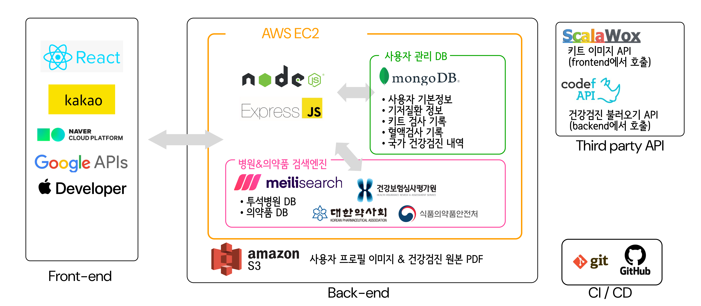

# H&S biolab Main

**성균관대학교 2024 산학 협력 프로젝트** 

<aside>

- **🇬 Github**: [https://github.com/H-S-Biolab](https://github.com/H-S-Biolab)
- ** App Store:**
- **▶ Google Play Store**:
- **🇫 Figma:** https://www.figma.com/design/LcEW0oalIVIRfc4RlFhhjx/2024_SKKU_H%26Sbiolab_%EC%82%B0%ED%95%99%ED%98%91%EB%A0%A5%ED%94%84%EB%A1%9C%EC%A0%9D%ED%8A%B8?node-id=1650-3879&p=f&t=jijAtUDrlEp4BoYg-0
</aside>

---

- ❗중요
    1. [Codef API key 2월23일 만료 예정!](https://www.notion.so/Codef-API-16d120bb7330804f979ff25f2778b97d?pvs=21)

# 1. 프로젝트 개요

## 🏔️프로젝트 목표

<aside>

신장병은 초기에 증상이 거의 나타나지 않아 조기 진단이 어렵습니다. 하지만 신장 기능이 저하되면 심각한 건강 문제로 이어질 수 있으며, 말기 신부전으로 발전할 경우 투석이나 신장 이식이 필요하게 됩니다. 

2024 H&S biolab 산학 협력 프로젝트는 신장병 조기진단 키트 연동 어플을 개발을 통해 신장병을 더 일찍 발견하고 치료함으로써, 장기적인 합병증을 예방하고 환자의 삶의 질을 향상시키는 것을 목표로 합니다. 

</aside>

## 😃팀원

| 이름 | 1학기 업무 | 2학기 업무 |
| --- | --- | --- |
| 곽태윤 | 백엔드 / Tech Lead | 로그인 / 건강검진 back & front |
| 김지수 | 프론트엔드 / Product Manager | 홈 / 사용자 정보 / 푸시알람 back & front
Google Analytics 연동 |
| 오지훈 | 프론트엔드 / SW developer | Team Leader
키트 검사 frontend & 비전 모델 개발 |
| 최한송 | 백엔드 / Team Leader | 의약품 검색 back & front
CI / CD 환경 구축 |
| 황재현 | 프론트엔드 /  SW developer | 투석병원 검색 back & front
키트 인식 비전 모델 개발 |

## 🏆 프로젝트 성과

- 건강보험심사평가원 보건의료빅데이터활용 창업경진대회 | 우수상
- 식품의약품안전처 식의약 데이터 활용 경진대회 | 장려상

---

# 2. 프로젝트 설명

## 🔎 H&S 바이오랩 앱 기능

### **1. 키트 검사**

키트 검사 방법을 설명하고, 키트 검사를 실시합니다. 사용자가 키트의 이미지를 Scala Wox의 API에 전송하면, 키트 검사의  결과를 반환받아서 데이터베이스에 저장합니다. 

### **2. 건강검진 불러오기**

[Codef API의 건강검진 api](https://developer.codef.io/products/public/each/pp/nhis-health-check)를 통해 보건복지부에서 사용자의 건강검진 기록과 건강검진 결과 원본 pdf를 불러옵니다. 불러온 건강검진 결과를 통해 분석을 제공하고, 나아가 신장병과 긴밀히 연관되어 있는 기저질환 및 성인병도 분석할 예정입니다. 

### **3. 혈액검사 기록하기**

신장병 고위험군 혹은 환자는 병원에서 혈액검사를 정기적으로 실시하게 되어있습니다. 이러한 혈액검사 결과를 기록할 수 있는 기능입니다.  기록한 혈액검사 결과를 통해 신장의 상태를 분석합니다. 

### **4. 나의 콩팥 건강 분석**

건강검진과 혈액검사 기록을 통해 사용자의 콩팥 기능을 분석합니다. 

### **5. 데일리 체크**

콩팥의 상태를 체크할 수 있는 6가지 항목으로 이루어진 설문지를 매일매일 체크하도록 합니다. 만약 설문 결과 3개 이상의 항목에서 이상이 있으면 키트 검사를 유도합니다. 

### **6. 투석 병원 검색**

[혈액투석 적정성 평가 등급](https://www.hira.or.kr/ra/hosp/getHealthMap.do?pgmid=HIRAA030002010000&WT.gnb=%EB%B3%91%EC%9B%90+%C2%B7+%EC%95%BD%EA%B5%AD%EC%B0%BE%EA%B8%B0#a) 정보와 위치 정보 등을 통해 주변 병원을 검색하는 기능입니다. 거리, 등급, 병원 종류 등의 필터를 통해 다양한 검색이 가능하고, 자주 찾는 병원은 즐겨찾기로 지정 가능합니다.  

### **7. 의약품 검색**

[식품의약품안전처의 의약품 데이터](https://www.data.go.kr/data/15075057/openapi.do)를 기반으로 의약품 검색합니다. [대한약사협회에서 제공하는 신장병 위해 성분 정보](https://www.health.kr/Menu.PharmReview/_uploadfiles/Safety%20Report_%EC%8B%A0%EC%9E%A5%EC%97%90%20%EC%98%81%ED%96%A5%EC%9D%84%20%EB%AF%B8%EC%B9%98%EB%8A%94%20%EC%95%BD%EB%AC%BC%20%EC%95%88%EC%A0%84%EC%84%B1%20%EC%A0%95%EB%B3%B4.pdf)를 제공해서 어떤 의약품이 신장에 해로운지 검색 가능합니다. 

## 👤 사용자 다이어그램

## 🏗️ 앱 구성도

## 🔎 프론트 엔드 & 백엔드 설명

<aside>

[프론트엔드](https://www.notion.so/16d120bb7330808aa9ffe7f1e1f67c91?pvs=21)

- [코드 상세 설명](https://www.notion.so/16d120bb73308082b243f1bef78d342b?pvs=21)
- [Scala Wox API 설명](https://www.notion.so/ScalaWox-API-16d120bb733080aaa6d4dd7ae25b1744?pvs=21)
- [IOS 빌드 환경](https://www.notion.so/IOS-16d120bb733080bbad83f7260558bf96?pvs=21)
- [로그인 정책 설명](https://www.notion.so/16d120bb733080d7896ef6d73f45d21f?pvs=21)
- [푸시 알람 구현 설명](https://www.notion.so/16d120bb733080b3b965e7f2e32f999e?pvs=21)
</aside>

<aside>

[백엔드](https://www.notion.so/16d120bb733080e598dcec073759ff49?pvs=21)

- [API 명세](https://www.notion.so/API-16d120bb7330802d80b4ea6fc5287345?pvs=21)
- [CI / CD](https://www.notion.so/CI-CD-16d120bb733080888f9ded5b96bb350e?pvs=21)
- [백엔드 프로세스& 포트 설명](https://www.notion.so/16d120bb73308088b755dcad38e01745?pvs=21)
- [AWS 계정 관리](https://www.notion.so/AWS-16d120bb73308010a7fadfc4e527be23?pvs=21)
- [Codef API 키 관리](https://www.notion.so/Codef-API-16d120bb7330804f979ff25f2778b97d?pvs=21)
- [의약품 DB 설명](https://www.notion.so/DB-16d120bb7330808084a1d874c7887355?pvs=21)
- [투석병원 DB 설명](https://www.notion.so/DB-16d120bb733080fdaabfe0409af6a5fc?pvs=21)
- [사용자 DB 설명](https://www.notion.so/DB-16d120bb7330802ea48bf4ef973d247b?pvs=21)
</aside>

[문서화 작업 업무 분배(임시)](https://www.notion.so/16d120bb733080c0a890ff0f9329ed41?pvs=21)
