# H&S biolab

**성균관대학교 2024 산학 협력 프로젝트** 

<aside>

- **🇬 Github**: [https://github.com/H-S-Biolab](https://github.com/H-S-Biolab)
- **🇳 Notion**: [https://cookie-process-67f.notion.site/](https://cookie-process-67f.notion.site/)
- ** App Store:** 
- **▶ Google Play Store:**
- **🇫 Figma:** [https://www.figma.com/design/LcEW0oalIVIRfc4RlFhhjx/2024_SKKU_H%26Sbiolab_%EC%82%B0%ED%95%99%ED%98%91%EB%A0%A5%ED%94%84%EB%A1%9C%EC%A0%9D%ED%8A%B8?node-id=1650-3879&p=f&t=jijAtUDrlEp4BoYg-0](https://www.figma.com/design/LcEW0oalIVIRfc4RlFhhjx/2024_SKKU_H%26Sbiolab_%EC%82%B0%ED%95%99%ED%98%91%EB%A0%A5%ED%94%84%EB%A1%9C%EC%A0%9D%ED%8A%B8?node-id=1650-3879&p=f&t=jijAtUDrlEp4BoYg-0)

</aside>

# 1. 프로젝트 개요

## 🏔️프로젝트 목표

<aside>

신장병은 초기에 증상이 거의 나타나지 않아 조기 진단이 어렵습니다.  
하지만 신장 기능이 저하되면 심각한 건강 문제로 이어질 수 있으며,  
말기 신부전으로 발전할 경우 투석이나 신장 이식이 필요하게 됩니다.

2024 H&S biolab 산학 협력 프로젝트는  
**신장병 조기진단 키트 연동 어플**을 개발해,  
신장병을 더 일찍 발견하고 치료함으로써  
장기적인 합병증을 예방하고  
환자의 삶의 질을 향상시키는 것을 목표로 합니다.

</aside>

  

## 😃팀원

<table>
  <thead>
    <tr>
      <th>이름</th>
      <th>1학기 업무</th>
      <th>2학기 업무</th>
    </tr>
  </thead>
  <tbody>
    <tr>
      <td>곽태윤</td>
      <td>백엔드 / Tech Lead</td>
      <td>로그인 / 건강검진 back &amp; front</td>
    </tr>
    <tr>
      <td>김지수</td>
      <td>프론트엔드 / Product Manager</td>
      <td>홈 / 사용자 정보 / 푸시알람 back &amp; front Google Analytics 연동</td>
    </tr>
    <tr>
      <td>오지훈</td>
      <td>프론트엔드 / SW developer</td>
      <td>Team Leader 키트 검사 frontend &amp; 비전 모델 개발</td>
    </tr>
    <tr>
      <td>최한송</td>
      <td>백엔드 / Team Leader</td>
      <td>의약품 검색 back &amp; front CI / CD 환경 구축</td>
    </tr>
    <tr>
      <td>황재현</td>
      <td>프론트엔드 / SW developer</td>
      <td>투석병원 검색 back &amp; front 키트 인식 비전 모델 개발</td>
    </tr>
  </tbody>
</table>

## 🏆 프로젝트 성과

- 건강보험심사평가원 보건의료빅데이터활용 창업경진대회 | **우수상**
- 식품의약품안전처 식의약 데이터 활용 경진대회 | **장려상**

---

# 2. 프로젝트 설명

## 🔎 H&S 바이오랩 앱 기능

### 1. 키트 검사

키트 검사 방법을 설명하고, 키트 검사를 실시합니다. 사용자가 키트의 이미지를 Scala Wox의 API에 전송하면, 키트 검사의 결과를 반환받아서 DB에 저장합니다.

  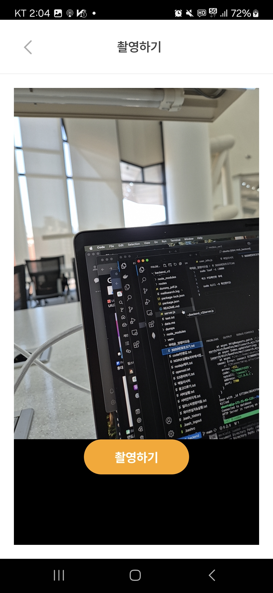
  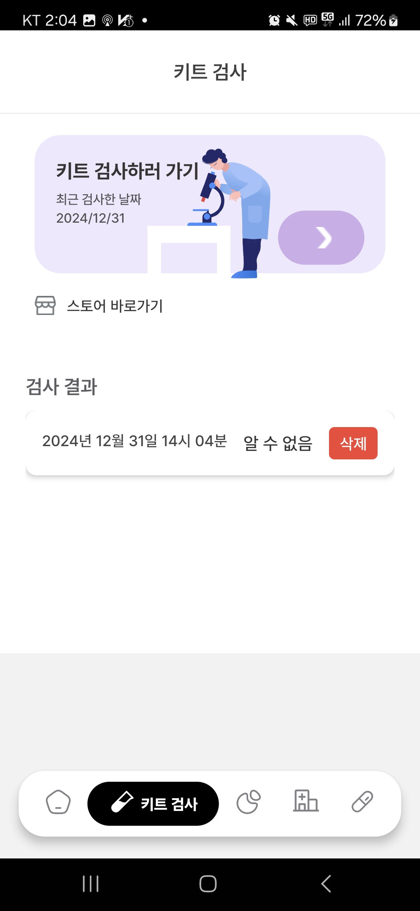

### 2. 건강검진 불러오기

[Codef API의 건강검진 API](https://developer.codef.io/products/public/each/pp/nhis-health-check)를 통해 보건복지부에서 사용자의 건강검진 기록과 결과 PDF를 불러옵니다. 불러온 결과를 분석하고, 신장병과 긴밀히 연관된 기저질환·성인병 분석도 진행할 예정입니다.

  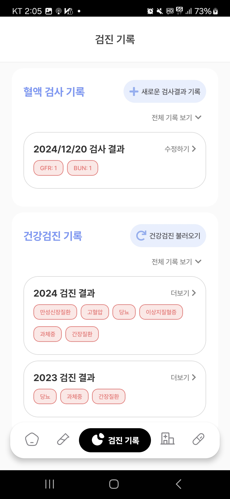
  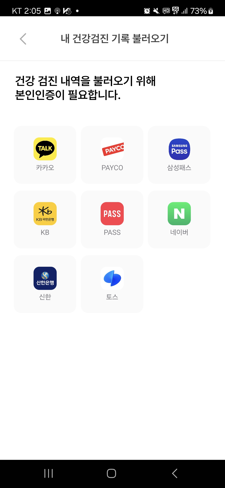

### 3. 혈액검사 기록하기

신장병 고위험군 혹은 환자는 정기적으로 혈액검사를 실시합니다. 앱에서 혈액검사 결과를 기록하고, 분석 결과를 제공합니다.

  
  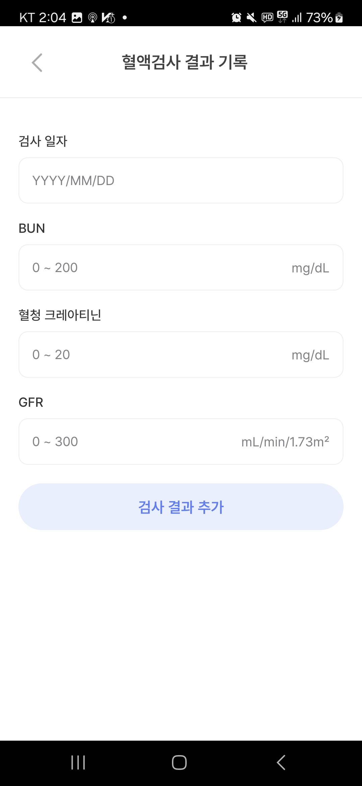

### 4. 나의 콩팥 건강 분석

건강검진 및 혈액검사 기록을 통해 사용자의 콩팥 기능을 종합 분석합니다.

  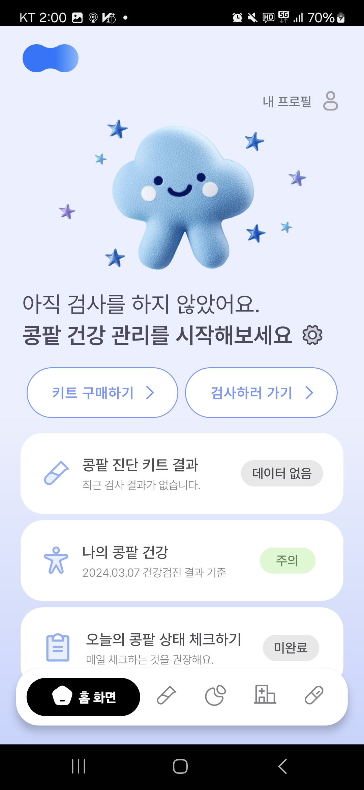
  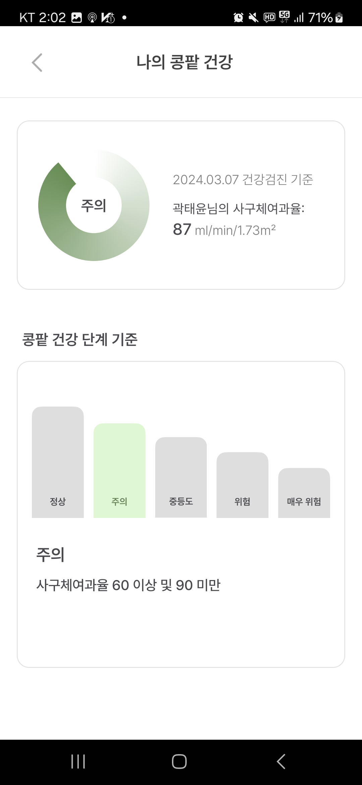

### 5. 데일리 체크

콩팥 상태를 매일 체크할 수 있는 6가지 항목을 제공하며, 3개 이상 위험 신호가 감지되면 키트 검사를 유도합니다.

  
  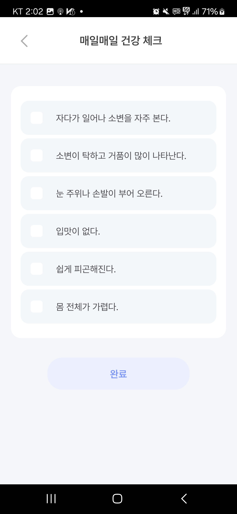

### 6. 투석 병원 검색

[혈액투석 적정성 평가 등급](https://www.hira.or.kr/ra/hosp/getHealthMap.do?pgmid=HIRAA030002010000&WT.gnb=%EB%B3%91%EC%9B%90+%C2%B7+%EC%95%BD%EA%B5%AD%EC%B0%BE%EA%B8%B0#a)을 참고하여  주변 투석 병원을 검색할 수 있습니다. 거리, 등급, 병원 종류 등의 필터가 제공되며, 자주 찾는 병원은 즐겨찾기로 지정할 수 있습니다.

  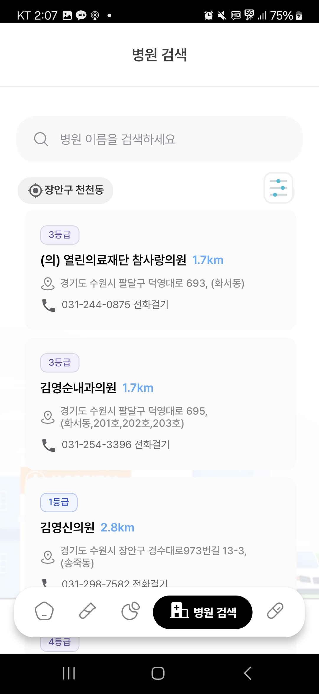
  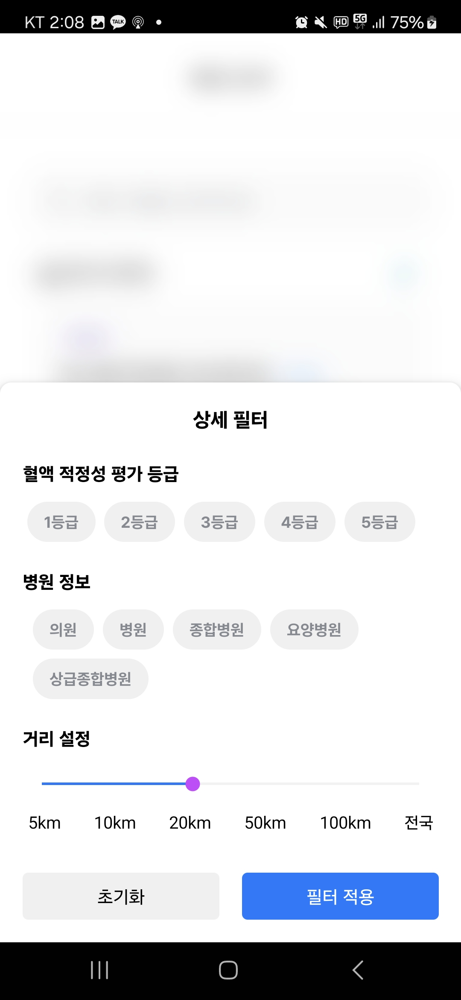

### 7. 의약품 검색
**[식품의약품안전처 의약품 데이터](https://www.data.go.kr/data/15075057/openapi.do)를 바탕**으로 의약품을 검색할 수 있습니다. [대한약사협회 신장병 위해 성분 정보](https://www.health.kr/Menu.PharmReview/_uploadfiles/Safety%20Report_%EC%8B%A0%EC%9E%A5%EC%97%90%20%EC%98%81%ED%96%A5%EC%9D%84%20%EB%AF%B8%EC%B9%98%EB%8A%94%20%EC%95%BD%EB%AC%BC%20%EC%95%88%EC%A0%84%EC%84%B1%20%EC%A0%95%EB%B3%B4.pdf)도 참고하여, 어떤 의약품이 신장에 해로운지 안내합니다.

  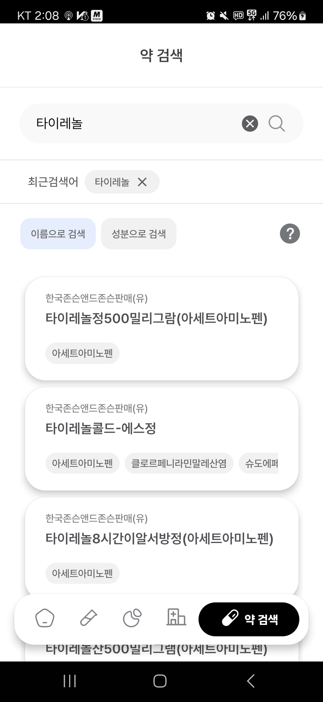 
  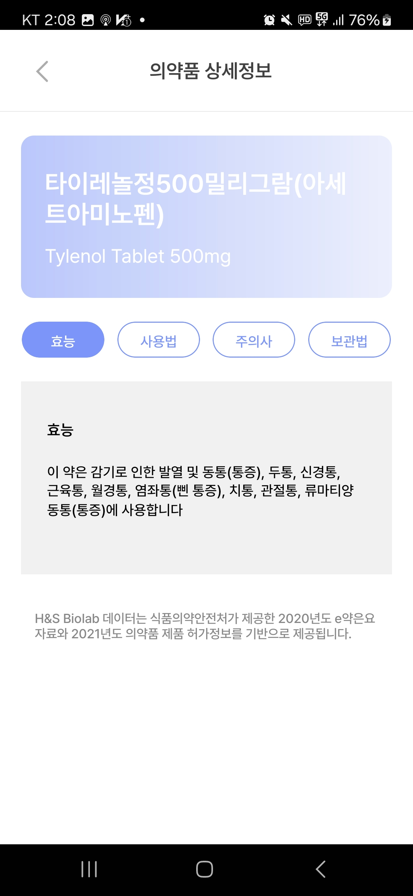

---

## 👤 사용자 다이어그램

  

## 🏗️ 앱 구성도

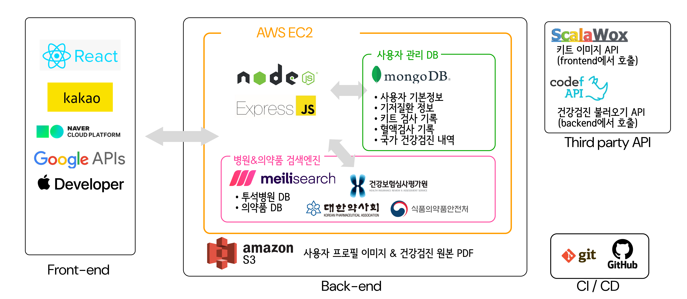

## 🔎 프론트엔드 & 백엔드 설명

<aside>

[프론트엔드](https://www.notion.so/16d120bb7330808aa9ffe7f1e1f67c91?pvs=21)

- [코드 상세 설명](https://www.notion.so/16d120bb73308082b243f1bef78d342b?pvs=21)
- [Scala Wox API 설명](https://www.notion.so/ScalaWox-API-16d120bb733080aaa6d4dd7ae25b1744?pvs=21)
- [IOS 빌드 환경](https://www.notion.so/IOS-16d120bb733080bbad83f7260558bf96?pvs=21)
- [로그인 정책 설명](https://www.notion.so/16d120bb733080d7896ef6d73f45d21f?pvs=21)
- [푸시 알람 구현 설명](https://www.notion.so/16d120bb733080b3b965e7f2e32f999e?pvs=21)

</aside>

<aside>

[백엔드](https://www.notion.so/16d120bb733080e598dcec073759ff49?pvs=21)

- [API 명세](https://www.notion.so/API-16d120bb7330802d80b4ea6fc5287345?pvs=21)
- [CI / CD](https://www.notion.so/CI-CD-16d120bb733080888f9ded5b96bb350e?pvs=21)
- [백엔드 프로세스 & 포트 설명](https://www.notion.so/16d120bb73308088b755dcad38e01745?pvs=21)
- [AWS 계정 관리](https://www.notion.so/AWS-16d120bb73308010a7fadfc4e527be23?pvs=21)
- [Codef API 키 관리](https://www.notion.so/Codef-API-16d120bb7330804f979ff25f2778b97d?pvs=21)
- [의약품 DB 설명](https://www.notion.so/DB-16d120bb7330808084a1d874c7887355?pvs=21)
- [투석병원 DB 설명](https://www.notion.so/DB-16d120bb733080fdaabfe0409af6a5fc?pvs=21)
- [사용자 DB 설명](https://www.notion.so/DB-16d120bb7330802ea48bf4ef973d247b?pvs=21)

</aside>

